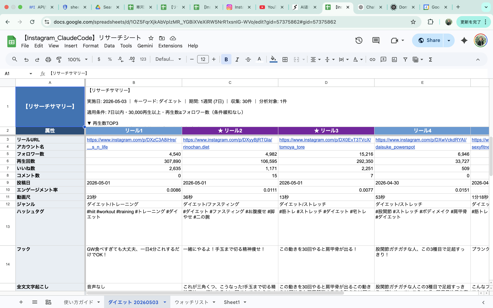

# Instagram リール バズ分析ツール

> キーワードを伝えるだけで、Instagram でバズっているリール動画を自動で集めて分析し、Google スプレッドシートにまとめてくれる「AI 自動リサーチ」ツールです。



## どんなことができる？

「**ダイエットでリサーチして**」 とチャットで話しかけるだけで、こんな結果が手に入ります：

- 📈 **直近で伸びているリール** を自動でピックアップ（最大15本）
- 🎙 **動画の音声を全文書き起こし**（AI が自動で行います・追加料金なし）
- 🎬 **動画のシーンごとに何が映っているか** AI が言語化
- 💡 **「なぜ伸びたか」「どう真似すればいいか」** を AI がコメント
- 🎵 **使われている BGM** や **動画のカット数** も自動で抽出
- ⭐ お気に入りアカウントは「ウォッチリスト」に登録して **定期チェック** も可能

すべての結果は **Google スプレッドシート** に自動でまとめられるので、 コピペ・スクショ不要で分析を共有・整理できます。

## こんな人に向いてます

- ✅ Instagram でリール運用をしている個人事業主・マーケター
- ✅ ベンチマークしたいアカウントを **継続して観察** したい人
- ✅ 同じジャンルで「**今何が伸びているか**」を **毎週/毎月** 調べたい人
- ✅ コーディングは苦手だけど、**AI ツールで業務を効率化** したい人

## 用意するもの（初回だけ）

| 項目 | 内容 | 費用 |
|---|---|---|
| 💻 **Mac** | Windows は未対応です（M1/M2/M3 推奨）| 無料 |
| 🤖 **Claude Code** | 話しかけて使う AI 補助ツール | 無料プランあり |
| 🌐 **3 つのサービス登録** | Apify / OpenAI / Google Cloud（後述）| 月 1,000〜2,500 円程度 |
| ⏰ **設定時間** | 1 回だけセットアップ作業が必要 | 約 45〜60 分 |

→ 詳しい設定方法はこちら： **[👉 セットアップ手順書](セットアップ手順書.md)**

## 月々のおおよそのコスト

| 項目 | 月額目安 |
|---|---|
| Instagram情報の自動取得（Apify） | 0〜1,500 円 |
| AI 分析（OpenAI） | 150〜750 円 |
| 音声→文字変換（Mac内蔵処理） | **0 円** |
| Google スプレッドシート連携 | **0 円** |
| **合計（週1回リサーチする想定）** | **750〜2,250 円 / 月** |

> ※ クレジットカード登録が必要です。利用しなければ請求は発生しません。

## 使い方の例

セットアップが終わったら、Claude Code のチャットでこんな風に話しかけます：

```
あなた:  ダイエットでリサーチして

AI:     リサーチを始めるね！以下を教えて：
        - キーワード（必須）：何を調べる？
        - 期間：7日 / 14日（既定）/ 30日 / 90日
        - 再生回数の条件：
          - 5万以上（既定）/ 10万以上 など
          - フォロワー比5倍以上 など

        特になければキーワードだけ教えてくれれば、
        デフォルト（14日間・5万再生以上）で実行するよ！

あなた:  ダイエット

AI:     （15〜30分後）
        リサーチ完了！30件収集→7件分析。スプシに反映済み: URL
```

→ Google スプレッドシートが自動で開くので、結果をすぐ確認できます。

## 詳しい使い方

→ **[👉 運用ガイド](運用ガイド.md)** で日々の使い方やお悩み解決方法を紹介しています。

主な機能：
- **キーワード調査** — 「ダイエットでリサーチして」「美容で1ヶ月分」など
- **お気に入りアカウントの登録** — 「@user1 をウォッチリストに追加」
- **定期チェック** — 毎月1日・15日に自動でウォッチリストを分析（任意）

## このツールの仕組み（参考）

```
あなたがキーワードを伝える
        ↓
Apify が Instagram の情報を自動収集
        ↓
最近 1〜2 週間に投稿されたリールに絞り込み
        ↓
Mac内蔵の AI が動画の音声を文字に変換
        ↓
ChatGPT が「なぜ伸びたか」「真似のしかた」を分析
        ↓
Google スプレッドシートに表として書き込み
```

裏側では複数の AI とクラウドサービスが動いていますが、 **あなたがやることはチャットで話しかけるだけ** です。

## ファイルの中身（参考・触らなくてOK）

```
ig-reel-research/
├── SKILL.md              # AI に使い方を教えるための説明書
└── scripts/              # 動作プログラム
    ├── run_production_research.py   # キーワード調査の本体
    ├── run_watchlist_research.py    # ウォッチリスト分析
    ├── add_to_watchlist.py          # アカウント登録ヘルパー
    ├── transcribe.py                # 音声・動画解析
    ├── pipeline.py                  # データの流れ管理
    └── gsheets.py                   # スプレッドシート連携
```

